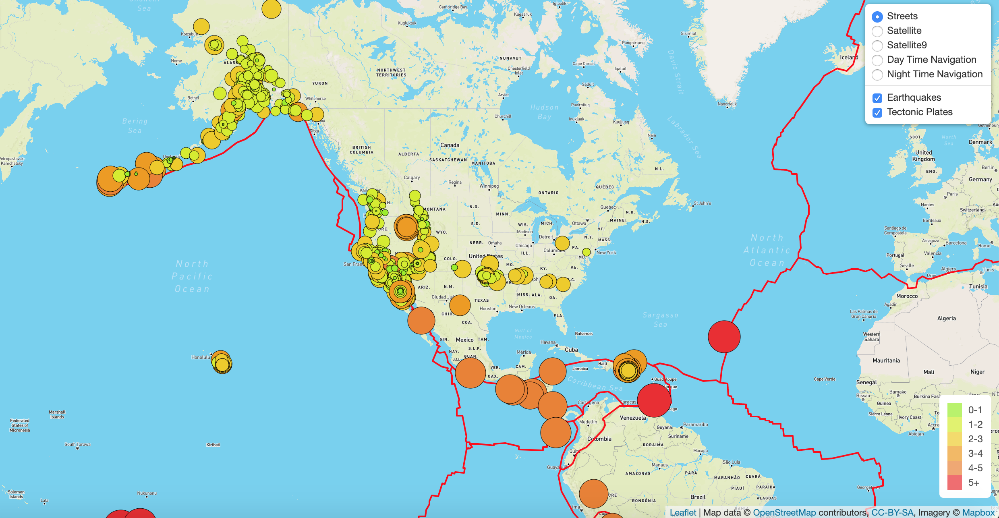
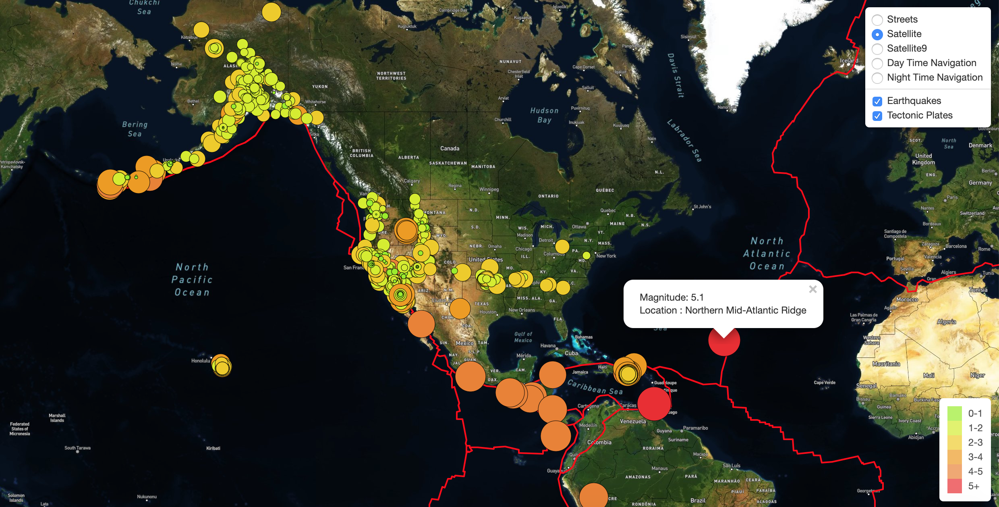
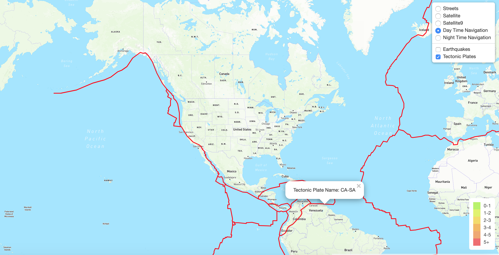
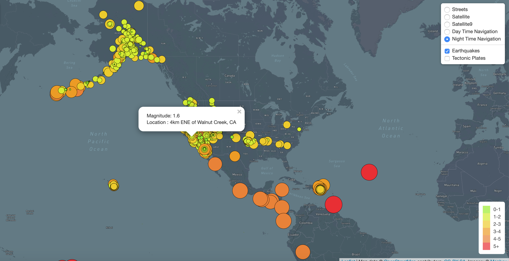

# Mapping_Earthquakes

## Overview:

   Mapping earthquakes provides live information of seismic activity based on USGS reported data with basic information about place and magnitude of the earthquake. Also the map can show different tectonic plates across the world.
   
## Technology:

  HTML
  Javascript
  D3 JS
  LeafletJS
  Mapbox API
  CSS for styling
  
## Pre-requisite:

  You need an account with MapBox (https://account.mapbox.com/), create and download API key from MapBox and create a file called config.js under static/js of your choice either Earthquakes_Challenge or Earthquakes_past7days.
  
  Content of the config.js file should be of the following sort
  
  const MAP_API_KEY = <YOUR API KEY FROM MAPBOX>
  
## Resources used:

Earthquake data sourced from USGS --> https://earthquake.usgs.gov/earthquakes/feed/v1.0/summary/all_week.geojson
Tectonic Plate source from github --> https://raw.githubusercontent.com/fraxen/tectonicplates/master/GeoJSON/PB2002_boundaries.json

## Details:

 Default rendered streets view with overlayed earthquake and tectonic plate information, provision to turn on/off earthquake and tectonic plate information is added. Earthquake highighted using circular marker whose size and color is based on magnitude of the earthquake. Legends are added explaining different colors and the correlation to the magnitude.
 
 Satellite view is added which can show the terrain information as characteristic in the map along with Earthquake and Tectonic Plate with popup to show one of the earthquake details 
 
 Using mapboxgl new daytime view of the map with just tectonic plate information is attached also highlighted one of the tectonic plate to see the name 
 
 Using mapboxgl new nighttime view of the map is also added with earthquake information 

  
 
